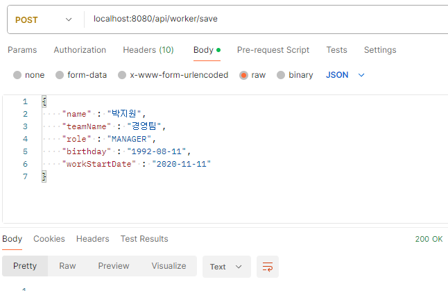
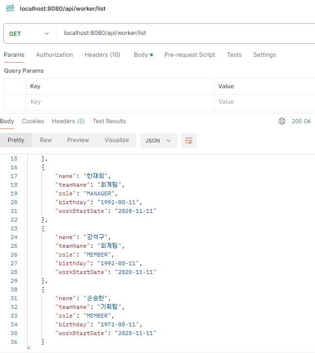

# 인프런 워밍업 클럽 0기 미니 프로젝트
해당 레포지토리는 인프런 워밍업 클럽 0기 미니 프로젝트 제출용 레포지토리입니다.  
코치님 아니어도 수정이 필요한 부분(기능이 부족하거나, 소스 수정(더 나아질 수 있는 부분))   
PR(pull request) 언제든지 보내주시면 반영하겠습니다.  

- [x] [1단계](#1단계)
- [ ] [2단계](#2단계)
- [ ] [3단계](#3단계)
- [ ] [4단계](#4단계)

## 사용 기술 스택
- JAVA 17  
- Spring Boot 3.2.3  
- JPA  
- MYSQL  

## DB 테이블 구조
### team

### worker

# 기능 정리
## 1단계
### 팀 
- 소스
  - [controller](src/main/java/com/warmingup/mini/controller/TeamController.java)
  - [service](src/main/java/com/warmingup/mini/service/TeamService.java)
  - [domain](src/main/java/com/warmingup/mini/domain/Team.java)
- 기능
  - 저장  
  
  - 조회  
  
  - DB 데이터  
  

### 직원
- 소스
  - [controller](src/main/java/com/warmingup/mini/controller/WorkerController.java)
  - [service](src/main/java/com/warmingup/mini/service/WorkerService.java)
  - [domain](src/main/java/com/warmingup/mini/domain/Worker.java)
- 기능
  - 저장  
  
  - 같은 팀의 MANAGER가 이미 존재할 때  
    
  
  - 조회  
  
  - DB 데이터  
  

### TODO
양 쪽 모두 조회시 JPA N+1이 발생하는 것으로 보임    
N+1이 맞는지 확실하게 확인하고 Join을 사용하도록 수정 필요해 보임  

---
## 2단계

---

## 3단계

---
## 4단계
